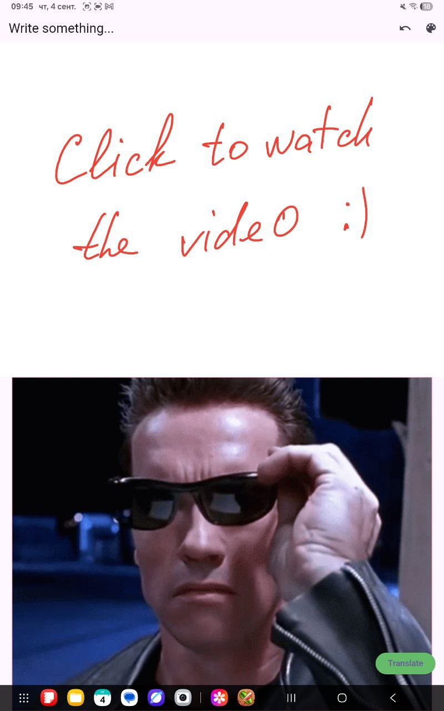

# AI Translator — Draw & Translate (Flutter + Gemini)

> Handwrite or sketch text on a canvas and translate **English → Ukrainian** using **Gemini 2.0 Flash** via **Firebase AI**. Built with Flutter and BLoC.

<p align="left">
  
  
  
  
  
</p>

## TL;DR

* **What it is:** A compact AI translator that captures a drawing canvas as an image and asks Gemini to OCR+translate handwriting.
* **Why it’s interesting:** Demonstrates AI integration (multimodal prompts), custom drawing UI, robust state management, and thoughtful UX (edge cases & error states) — all in a tidy, hiring-ready repo.
* **Tech highlights:** BLoC (Cubit), CustomPainter + Screenshot, Firebase initialization, inline image prompting for Gemini, clear prompt-engineering for OCR+translation.

---

## Demo

* [▶️ Watch 40‑second demo (Google Drive)](https://drive.google.com/file/d/1Vqboi4O8o8vID1s7SFM4UPFBqQzBKuE8/view)

<p>
  <a href="https://drive.google.com/file/d/1Vqboi4O8o8vID1s7SFM4UPFBqQzBKuE8/view">
    
  </a>
</p>

## Features

* ✍️ **Draw & write** on an infinite canvas (CustomPainter) with a **color picker** and **Undo**.
* 🖼️ One‑tap capture of the canvas to PNG (Screenshot controller).
* 🤖 **Gemini 2.0 Flash** prompt for **OCR + translation** (English → Ukrainian) via **Firebase AI**.
* 🧠 **BLoC/Cubit** state machine: idle → loading → result / error.
* 🎭 Delightful UX touches: **loading GIF** and **error GIF** ("T‑800/T‑1000" vibe) for edge cases.
* 🛡️ Defensive handling for “no English text found” with a playful fallback.

> **Employer highlights**
>
> * Clean, readable layering: **presentation / cubit / services**, no God classes.
> * Multimodal prompt-engineering with **InlineDataPart** (image JPEG) + deterministic parsing of model output.
> * Simple, portable Firebase setup that works for both iOS & Android.

## How it works

1. User writes text on the canvas → the widget stack renders via **CustomPainter**.
2. A **ScreenshotController** captures the current canvas as `Uint8List`.
3. The **TranslatorCubit** calls `AiTranslatorService.recognizeAndTranslate(bytes)`.
4. `firebase_ai` client sends a **multi‑part prompt** (instruction + inline image) to **Gemini 2.0 Flash**.
5. The service returns translated text; the UI updates accordingly.

Mermaid overview:

```mermaid
flowchart LR
  UI[DrawAndTranslatePage] -->|events| CUBIT[TranslatorCubit]
  CUBIT -->|recognizeAndTranslate(Uint8List)| SVC[AiTranslatorService]
  SVC -->|generateContent| GEM[Gemini 2.0 Flash
(Firebase AI)]
  GEM -->|text| CUBIT
  CUBIT -->|state| UI
```

## Project structure (excerpt)

```
lib/
  app_constants/
    app_constants.dart          # Prompt text & constants
  cubit/
    translator_cubit.dart       # BLoC/Cubit for translate flow
    translator_state.dart
  presentation/
    draw_and_translate_page.dart
    drawing_painter.dart        # CustomPainter for strokes
  services/
    ai_translator_service.dart  # Firebase AI (Gemini) integration
    firebase_options.dart       # FlutterFire config (generated)
  main.dart
```

## Prompt (summary)

The system prompt instructs Gemini to **read all English text** (including handwriting) from the image and **translate it into Ukrainian**, preserving line breaks, avoiding extra commentary, and handling edge cases (mixed languages, best‑guess for hard‑to‑read text, and a playful fallback when nothing English is found).


## Tech Stack

* **Flutter** 3.x, **Dart** 3.x
* **State management:** `flutter_bloc`
* **Drawing & capture:** `CustomPainter`, `screenshot`
* **AI:** `firebase_ai` with **Gemini 2.0 Flash**
* **Firebase:** `firebase_core` + generated `firebase_options.dart`

## Getting Started

### Prerequisites

* Flutter 3.x (`flutter --version`)
* Xcode / Android Studio toolchains
* A Firebase project with **FlutterFire** configured and **Firebase AI** enabled

### Setup

```bash
# 1) Clone
git clone https://github.com/tihorskiialeks/ai-translator.git
cd ai-translator

# 2) Install deps
flutter pub get

# 3) Configure Firebase (once per platform)
flutterfire configure  # generates lib/services/firebase_options.dart

# 4) iOS/Android
# - iOS: add URL schemes if using Google Sign-In later; set bundle id in Xcode
# - Android: update applicationId if needed; ensure Google services plugin applied

# 5) Assets (GIFs & screenshots)
# In pubspec.yaml, ensure:
# assets:
#   - assets/terminator.gif
#   - assets/terminator_no.gif
#   - assets/screenshots/
```

### Run

```bash
flutter run -d android
flutter run -d ios
```

### Build

```bash
flutter build apk --release
flutter build ipa --release
```

## Configuration

No secret tokens are stored in code. Firebase is configured via FlutterFire (`firebase_options.dart`).


## Acknowledgements

* Gemini 2.0 Flash via Firebase AI
* Flutter & the open‑source packages used


---

### About the author

**Oleksandr Tykhorskyi** — Flutter Developer.

* LinkedIn :https://www.linkedin.com/in/oleksandr-tykhorskyi-7a7b10243
* Email: tihorskiialeks@gmail.com


